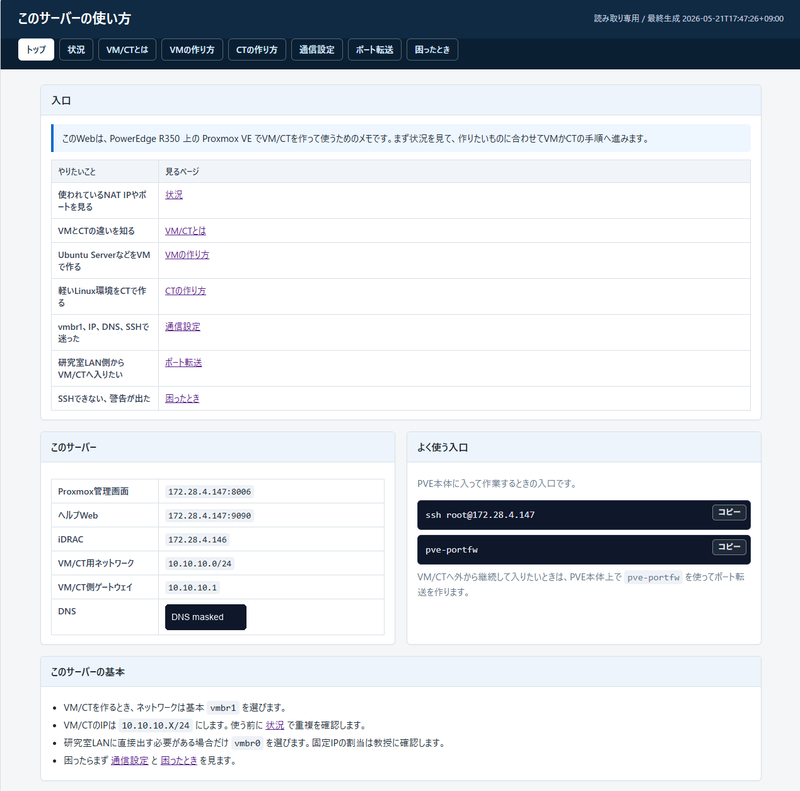
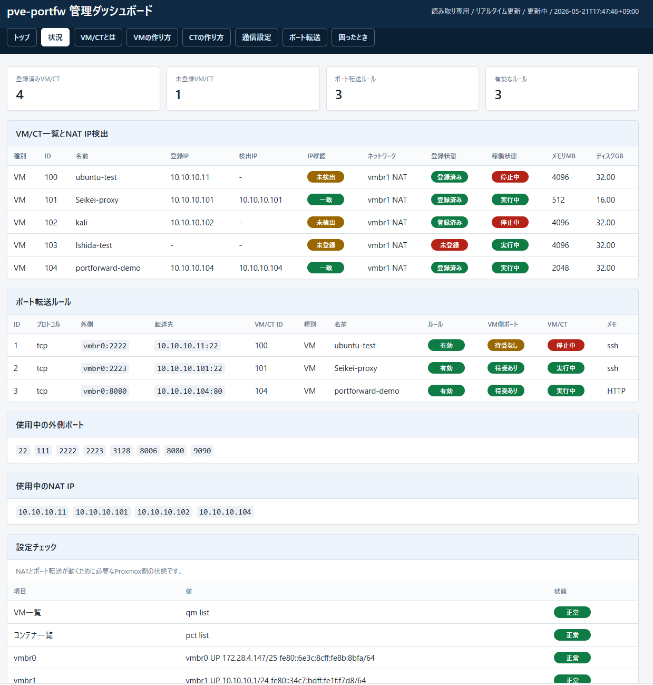
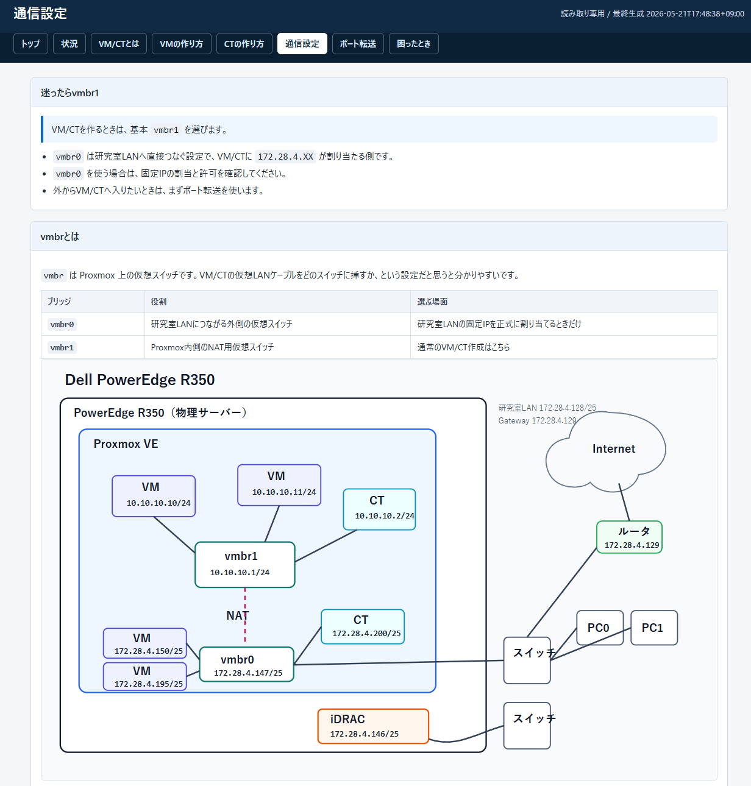

# pve-portfw

研究室のProxmox VEで使う、VM/CT向けのポート転送管理ツールです。

NAT内に置いたVMへ、研究室LANから必要なポートだけアクセスできるようにします。
CLIとWeb画面から、VMのIPアドレス、使用中ポート、転送ルールを確認・管理できます。

## 何をするツールか

通常、NAT内のVMは外部PCから直接アクセスできません。
このツールでは、Proxmox側のポートをVM内のサービスへ転送します。

```text
Proxmox側 8080番ポート -> NAT内VMの80番ポート
```

これにより、研究室LAN側のブラウザから、NAT内VMで動くWebサーバーを確認できます。

## なぜ作ったか

VMを作るたびに、iptablesのポート転送設定を手で書くのが大変だったためです。

手作業では、次のような問題がありました。

- 設定コマンドが長く、ミスしやすい
- どのVMにどのポートを割り当てたか分かりにくい
- 外部ポートの重複に気づきにくい
- VMのIPアドレスを手動設定しているため、使用中IPを確認する必要がある

そこで、VM ID・IPアドレス・転送ポートを台帳化し、CLI/Webから安全に管理できるようにしました。

## 主な機能

- VM/CTとNAT内IPの一覧表示
- 使用中IPと使用中ポートの確認
- ポート転送ルールの追加・削除
- iptablesへの自動反映
- NATや転送設定の診断
- Web画面での状態確認とヘルプ表示

## 実行ファイル

このリポジトリには、CLI用の `pve-portfw` とWeb表示用の `pve-portfw-web` の2つの実行ファイルがあります。

### `pve-portfw`

ポート転送を管理するためのBash製CLIです。

VM/CTのNAT IPを台帳に登録し、外側ポートとVM/CT側ポートの対応を追加・削除できます。
主に、転送ルールの追加・削除、使用中ポートの確認、NAT IPの検出、iptables設定の診断に使います。

### `pve-portfw-web`

状態確認と手順確認のためのPython製Webダッシュボードです。

ブラウザからVM/CTの登録状況、使用中IP、使用中ポート、転送ルール、NAT設定の状態を確認できます。
また、VM/CTの作成手順やネットワーク設定、ポート転送の使い方を日本語のヘルプとして表示します。

Web側は読み取り専用で、実際の登録・追加・削除は `pve-portfw` CLIで行います。

## スクリーンショット

### ヘルプWeb



### 管理ダッシュボード



### 通信設定ページ



## デモ動画

NAT内VMでnginxを起動し、ポート転送ルールを追加することで研究室LAN側からWebページへ到達できる様子を録画しました。

[デモ動画を見る](docs/assets/pve-portfw-demo.mp4)

## 工夫した点

- iptablesを直接手で管理せず、台帳ファイルをもとに反映する設計にした
- ポート追加時に、既存ルールやProxmox本体の使用ポートと衝突しないか確認するようにした
- VM側のポートが開いていない場合は警告を出し、原因調査しやすくした
- systemdで起動時にルールを再適用し、再起動後も設定が残るようにした
- 研究室メンバーが使いやすいように、日本語のWebヘルプを用意した

## 使用技術

- Bash
- Python
- iptables
- systemd
- Proxmox VE
- HTML/CSS
- PowerShell
